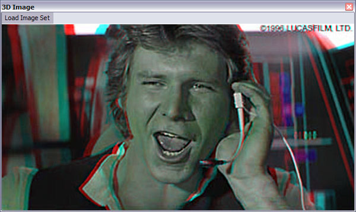



## Breakout your 3D Glasses\! Mix 3D Images

### Description

Breakout your 3D Glasses! Mix 3D images from stereo photos in real-time... with included samples I found on the net. Mainly for fun but could be useful as a demonstration how to read/modify RGB pixel values... or for the foundation of a more robust 3D Imaging application. Intermediate-level is a stretch but it does use a few APIs.
 
### More Info
 

             |
---                |---
**Submitted On**   |2006-02-07 20:55:12
**By**             |[PlanetBoogie](https://github.com/Planet-Source-Code/PSCIndex/blob/master/ByAuthor/planetboogie.md)
**Level**          |Intermediate
**User Rating**    |4.8 (19 globes from 4 users)
**Compatibility**  |VB 6\.0
**Category**       |[Graphics](https://github.com/Planet-Source-Code/PSCIndex/blob/master/ByCategory/graphics__1-46.md)
**World**          |[Visual Basic](https://github.com/Planet-Source-Code/PSCIndex/blob/master/ByWorld/visual-basic.md)
**Archive File**   |[Breakout\_y197096272006\.zip](https://github.com/Planet-Source-Code/planetboogie-breakout-your-3d-glasses-mix-3d-images__1-64259/archive/master.zip)

